# Dspeech architecture diagrams — MVP slice (2026-05-19)

Mermaid diagrams of the wired MVP slice (W2–W5 of `docs/PLAN-2026-05-19.md`).
Every box and every arrow is anchored to real source paths. Privacy-boundary
annotations follow ADR 0002 (`docs/adr/0002-privacy-local-only-default.md`):
the count of Dspeech-originated `[OFF-DEVICE]` boxes must be **zero** in the
default `PrivacyMode.localOnly` configuration.

Conventions used inside the diagrams:

- `[LOCAL]` — runs in-process on the iPhone, never opens a socket, never
  receives a cloud round-trip. This is the only tag that appears below.
- `[OFF-DEVICE]` — would mean a Dspeech-originated network egress. Reserved
  for future cloud-fallback paths; **must not appear** while ADR 0002 holds.
- `[SYSTEM]` — first-party Apple OS surface (microphone hardware, Speech
  daemon, Translation daemon, OS-owned model fetch). Apple's own model-asset
  download is system-owned and explicitly carved out of the privacy
  envelope (`docs/product/language-pack-spec.md`, ADR 0002); it is **not** a
  Dspeech network call.

## 1 — C4 Container view

Composition root (`Dspeech/App/DspeechApp.swift:4`) → `ContentView`
(`Dspeech/App/ContentView.swift:3`) → protocol seams in `Dspeech/Core/*` →
concrete adapters. Frozen protocols are the architect-controlled contract
surface (`docs/architecture-mvp-slice-2026-05-19.md`); concrete impls live in
the same module and are swapped out by tests via `Dspeech/Core/**/*Protocol.swift`
seams.

```mermaid
flowchart TB
    classDef local fill:#0a2818,stroke:#39c46d,color:#d8ffe6
    classDef proto fill:#0d1f2d,stroke:#4fb3ff,color:#cfe8ff
    classDef apple fill:#1d1a2e,stroke:#b08cff,color:#e8dcff
    classDef storage fill:#231a07,stroke:#d3a04a,color:#ffe7bd

    subgraph BOUNDARY["Dspeech.app — PrivacyMode.localOnly (ADR 0002) — zero OFF-DEVICE egress"]
        direction TB

        subgraph APP["App / SwiftUI shell — Dspeech/App/"]
            direction TB
            ROOT["DspeechApp @main<br/>Dspeech/App/DspeechApp.swift:4<br/>[LOCAL]"]:::local
            CV["ContentView (root scene)<br/>Dspeech/App/ContentView.swift:3<br/>owns PrivacyBadge LOCAL/CLOUD<br/>[LOCAL]"]:::local
            LVM["LiveTranscriptionViewModel<br/>@MainActor @Observable<br/>Dspeech/App/LiveTranscriptionViewModel.swift:6<br/>[LOCAL]"]:::local
            FRVM["FirstRunViewModel<br/>@MainActor @Observable<br/>Dspeech/App/FirstRunView.swift:52<br/>[LOCAL]"]:::local
            SETV["SettingsView (sheet)<br/>Dspeech/App/ContentView.swift:210<br/>[LOCAL]"]:::local
        end

        subgraph CORE["Core / domain — Dspeech/Core/"]
            direction TB
            PS["PrivacySettings<br/>@MainActor @Observable<br/>Dspeech/Core/Settings/PrivacySettings.swift:56<br/>default: .localOnly<br/>[LOCAL]"]:::local
            LTE_P{{"protocol LiveTranscriptionEngine<br/>Dspeech/Core/ASR/LiveTranscriptionEngine.swift:19"}}:::proto
            TS_P{{"protocol TranslationService<br/>Dspeech/Core/Translation/TranslationServiceProtocol.swift:79"}}:::proto
            AIS_P{{"protocol AudioInputService<br/>Dspeech/Core/Audio/AudioInputServiceProtocol.swift:133"}}:::proto
            AISP_P{{"protocol AudioInputSessionPort<br/>Dspeech/Core/Audio/AudioInputServiceProtocol.swift:243"}}:::proto
            FRC_P{{"protocol FirstRunCoordinator<br/>Dspeech/Core/FirstRun/FirstRunCoordinatorProtocol.swift:64"}}:::proto
            FRS_P{{"protocol FirstRunStateStore<br/>Dspeech/Core/FirstRun/FirstRunCoordinatorProtocol.swift:43"}}:::proto
            PSS_P{{"protocol PrivacySettingsStorage<br/>Dspeech/Core/Settings/PrivacySettings.swift:27"}}:::proto
            TSEG[/"TranscriptSegment (value)<br/>Dspeech/Core/Models/TranscriptSegment.swift:3<br/>[LOCAL]"/]:::local
        end

        subgraph ADAPTERS["Adapters — concrete impls"]
            direction TB
            ASLT["AppleSpeechLiveTranscriptionEngine<br/>Dspeech/Core/ASR/AppleSpeechLiveTranscriptionEngine.swift:6<br/>AVAudioEngine + SFSpeechRecognizer<br/>requiresOnDeviceRecognition = true<br/>[LOCAL]"]:::local
            ATS["AppleTranslationService<br/>Dspeech/Core/Translation/TranslationService.swift:37<br/>TranslationSession(installedSource:target:)<br/>[LOCAL]"]:::local
            LTS["LocalTranslationService (decorator)<br/>Dspeech/Core/Translation/TranslationService.swift:137<br/>host-testable seam<br/>[LOCAL]"]:::local
            AAIS["AppleAudioInputService (orchestrator)<br/>Dspeech/Core/Audio/AudioInputService.swift:83<br/>route-reason mapping + debounce<br/>[LOCAL]"]:::local
            AVPORT["AVFoundationAudioInputSessionPort<br/>Dspeech/Core/Audio/AudioInputService.swift:309<br/>only AVFoundation calls live here<br/>[LOCAL]"]:::local
            AROBS["AudioRouteChangeObserver<br/>Dspeech/Core/Audio/AudioRouteChangeObserver.swift:23<br/>[LOCAL]"]:::local
            FRDEF["DefaultFirstRunCoordinator<br/>Dspeech/Core/FirstRun/FirstRunCoordinator.swift:52<br/>[LOCAL]"]:::local
            FRSTORE["UserDefaultsFirstRunStateStore<br/>Dspeech/Core/FirstRun/FirstRunCoordinator.swift:15<br/>[LOCAL]"]:::storage
            PSSTORE["UserDefaultsPrivacySettingsStorage<br/>Dspeech/Core/Settings/PrivacySettings.swift:32<br/>[LOCAL]"]:::storage
        end

        subgraph SYS["iOS system services — first-party Apple, [SYSTEM]"]
            direction TB
            MIC[["AVAudioSession.sharedInstance()<br/>.record / .measurement<br/>(USB-C / wired / built-in mic)"]]:::apple
            AVENG[["AVAudioEngine.inputNode tap<br/>1024-frame PCM buffers"]]:::apple
            SFR[["SFSpeechRecognizer<br/>on-device only"]]:::apple
            TSESS[["Translation.TranslationSession<br/>installed assets only"]]:::apple
            LAVAIL[["Translation.LanguageAvailability"]]:::apple
            UD[["UserDefaults.standard"]]:::apple
        end
    end

    ROOT --> CV
    CV --> LVM
    CV --> SETV
    CV -. shows on first launch .-> FRVM

    LVM --> LTE_P
    LVM --> TSEG
    FRVM --> FRC_P
    FRVM --> PS
    SETV --> PS
    CV --> PS

    LTE_P --> ASLT
    TS_P --> ATS
    TS_P --> LTS
    LTS -. wraps any backend .-> ATS
    AIS_P --> AAIS
    AISP_P --> AVPORT
    AAIS --> AISP_P
    AROBS --> AISP_P
    FRC_P --> FRDEF
    FRS_P --> FRSTORE
    PSS_P --> PSSTORE
    FRDEF --> FRS_P
    PS --> PSS_P

    ASLT --> MIC
    ASLT --> AVENG
    ASLT --> SFR
    ATS --> TSESS
    ATS --> LAVAIL
    AVPORT --> MIC
    FRSTORE --> UD
    PSSTORE --> UD
```



**Privacy ledger (ADR 0002).** `[LOCAL]` boxes: 17. Dspeech-originated
`[OFF-DEVICE]` boxes: **0**. `[SYSTEM]` Apple surfaces: 6, none of which
Dspeech reaches through a Dspeech-owned socket — `SFSpeechRecognizer` is
pinned `requiresOnDeviceRecognition = true`
(`AppleSpeechLiveTranscriptionEngine.swift:85`), `TranslationSession` uses
the installed-only initializer (`TranslationService.swift:97`), Apple's
asset fetch (if any) runs through the system-presented UI and is the
`language-pack-spec.md` "metadata for software updates" carve-out — never a
Dspeech call.

## 2 — Sequence: live-transcription happy path

Tap **Старт** (`ContentView.swift:91`, `start-button` a11y id) → audio
flows through Apple's daemons → finalized `TranscriptSegment`s render in
the transcript list. The whole path stays inside the privacy boundary;
buffers and partial strings cross only in-process actor hops.

```mermaid
sequenceDiagram
    autonumber
    participant U as User (tap "Старт")
    participant CV as ContentView<br/>(ContentView.swift:91)
    participant VM as LiveTranscriptionViewModel<br/>(@MainActor)
    participant ENG as AppleSpeechLiveTranscriptionEngine<br/>(@MainActor) [LOCAL]
    participant SESS as AVAudioSession.sharedInstance() [SYSTEM]
    participant AE as AVAudioEngine.inputNode tap [SYSTEM]
    participant REQ as SFSpeechAudioBufferRecognitionRequest [LOCAL]
    participant SFR as SFSpeechRecognizer<br/>requiresOnDeviceRecognition=true [SYSTEM]

    Note over CV,SFR: PrivacyMode = .localOnly. No socket is opened on this path.

    U->>CV: tap start-button
    CV->>VM: await toggleListening()  (ContentView.swift:131)
    VM->>VM: startObservingEvents() opens AsyncStream<LiveTranscriptionEvent><br/>(LiveTranscriptionViewModel.swift:43)
    VM->>ENG: await engine.start()  (LiveTranscriptionViewModel.swift:31)

    ENG->>ENG: status = .requestingPermission
    ENG->>SFR: SFSpeechRecognizer.requestAuthorization { … }<br/>(AppleSpeechLiveTranscriptionEngine.swift:163)
    SFR-->>ENG: .authorized
    ENG->>SESS: AVAudioApplication.requestRecordPermission()<br/>(AppleSpeechLiveTranscriptionEngine.swift:171)
    SESS-->>ENG: granted=true
    ENG->>SESS: setCategory(.record, mode: .measurement, [.duckOthers])<br/>setActive(true)  (line 78-79)
    ENG->>REQ: SFSpeechAudioBufferRecognitionRequest()<br/>shouldReportPartialResults=true, requiresOnDeviceRecognition=true<br/>(line 83-86)
    ENG->>AE: inputNode.installTap(bus:0, bufferSize:1024)  (line 95)
    ENG->>AE: audioEngine.prepare(); start()  (line 101-102)
    ENG->>SFR: recognitionTask(with: request, …)  (line 104)
    ENG->>VM: yield .status(.listening)  (didSet on status → emit, line 8)

    loop streaming buffers
        AE-->>ENG: tap callback PCM buffer (1024 frames) [LOCAL]
        ENG->>REQ: request.append(buffer)  (line 97)
        REQ->>SFR: feed buffer (system, on-device)
        SFR-->>ENG: result (isFinal=false) [SYSTEM→LOCAL]
        ENG->>VM: yield .partial(text)  (line 112)
        VM-->>CV: partialText updated → PartialTranscriptCard renders<br/>(ContentView.swift:79)
    end

    SFR-->>ENG: result.isFinal=true with SFTranscription<br/>(line 107-110)
    ENG->>ENG: emitFinalSegment → TranscriptSegment(source:.liveATC)<br/>(line 125-137; Models/TranscriptSegment.swift:3)
    ENG->>VM: yield .segment(TranscriptSegment)  (line 136)
    VM->>VM: segments.append(segment); partialText = ""<br/>(LiveTranscriptionViewModel.swift:52)
    VM-->>CV: segments redraws TranscriptSegmentCard list<br/>(ContentView.swift:72)
    Note over ENG: cleanup(); status = .stopped on final or error<br/>(line 115-120)
```

## 3 — Sequence: first-run cards 1 → 2 → 3 → completed

Cards from PRD §1.3 (`docs/product/prd-ios-mvp.md:42-44`) driven by the
pure state machine in `DefaultFirstRunCoordinator`
(`FirstRunCoordinator.swift:52`). Persistence is one `UserDefaults` bit
(`hasCompletedFirstRun`); permission prompts fire only at the **end** of
the sequence (`FirstRunView.swift:119`).

```mermaid
sequenceDiagram
    autonumber
    participant U as User
    participant V as FirstRunView<br/>(FirstRunView.swift:147)
    participant VM as FirstRunViewModel<br/>(@MainActor @Observable) [LOCAL]
    participant FRC as DefaultFirstRunCoordinator [LOCAL]
    participant STORE as UserDefaultsFirstRunStateStore [LOCAL]
    participant UD as UserDefaults.standard [SYSTEM]
    participant PR as SystemOnboardingPermissionRequester<br/>(FirstRunView.swift:16) [LOCAL]
    participant PS as PrivacySettings [LOCAL]

    Note over V,PS: Whole flow runs on-device — no network call, ever.

    U->>V: launch (fresh install)
    V->>VM: init(state: coordinator.currentState())
    VM->>FRC: currentState()  (FirstRunCoordinator.swift:62)
    FRC->>STORE: hasCompletedFirstRun()
    STORE->>UD: bool(forKey: "hasCompletedFirstRun")
    UD-->>STORE: false
    STORE-->>FRC: false
    FRC-->>VM: .showing(.receiveOnly)
    VM-->>V: render card 1 "Только приём"<br/>(first-run-card-1, FirstRunView.swift:232)

    U->>V: tap "Далее" (first-run-continue)
    V->>VM: advance()
    VM->>FRC: advance()  (FirstRunCoordinator.swift:70)
    FRC-->>VM: .showing(.localByDefault)
    VM-->>V: render card 2 "Локально по умолчанию"<br/>(first-run-card-2)

    U->>V: tap "Далее"
    V->>VM: advance()
    VM->>FRC: advance()
    FRC-->>VM: .showing(.wireForAccuracy)
    VM-->>V: render card 3 "Подключите гарнитуру"<br/>(first-run-card-3) + target-language picker<br/>(FirstRunView.swift:235)

    U->>V: tap "Начать" (first-run-continue, isLastCard)
    V->>VM: await finish()  (FirstRunView.swift:119)
    VM->>PS: privacy.mode = .localOnly  (line 123)
    VM->>PR: requestSpeechAndMicrophone()
    PR-->>VM: granted (or denied — onboarding continues regardless)
    VM->>FRC: advance()  (final step, line 128)
    FRC->>STORE: markFirstRunCompleted()<br/>(FirstRunCoordinator.swift:83)
    STORE->>UD: set(true, forKey: "hasCompletedFirstRun")
    UD-->>STORE: ok
    STORE-->>FRC: ok
    FRC-->>VM: .completed
    VM->>VM: settleIfCompleted() → onFinished()<br/>(FirstRunView.swift:135)
    VM-->>V: dismiss onboarding → ContentView appears
    Note over V: PrivacyBadge shows "LOCAL"<br/>(ContentView.swift:189, privacy-badge a11y id)
```



## Cross-references

- ADR 0002 — `docs/adr/0002-privacy-local-only-default.md` (privacy ledger
  rule, every box must be `[LOCAL]` or `[SYSTEM]` in default mode).
- Frozen contracts — `docs/architecture-mvp-slice-2026-05-19.md`.
- PRD acceptance — `docs/product/prd-ios-mvp.md` §1 (F3), §1.3 (first run),
  F5 (audio picker).
- Plan slice — `docs/PLAN-2026-05-19.md` (W2–W5 deliverables wired here).
